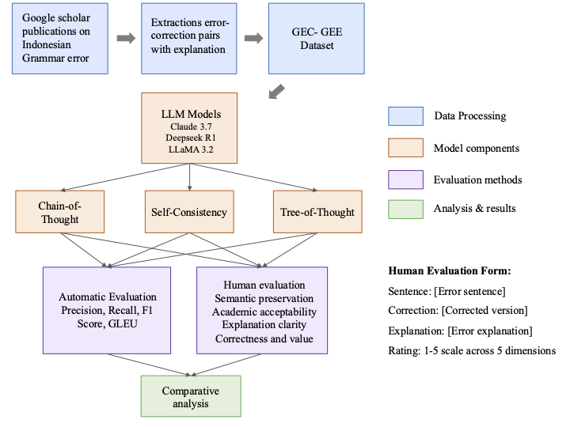
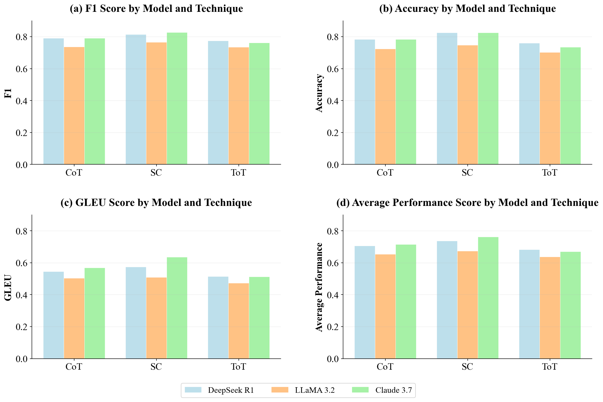
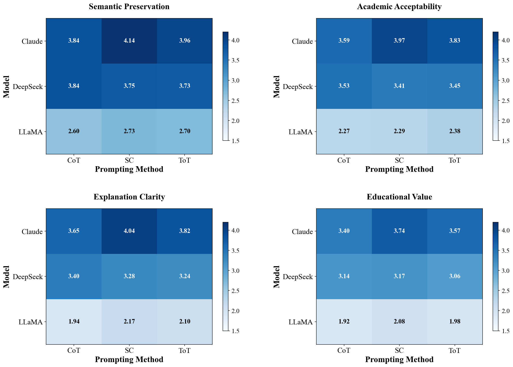
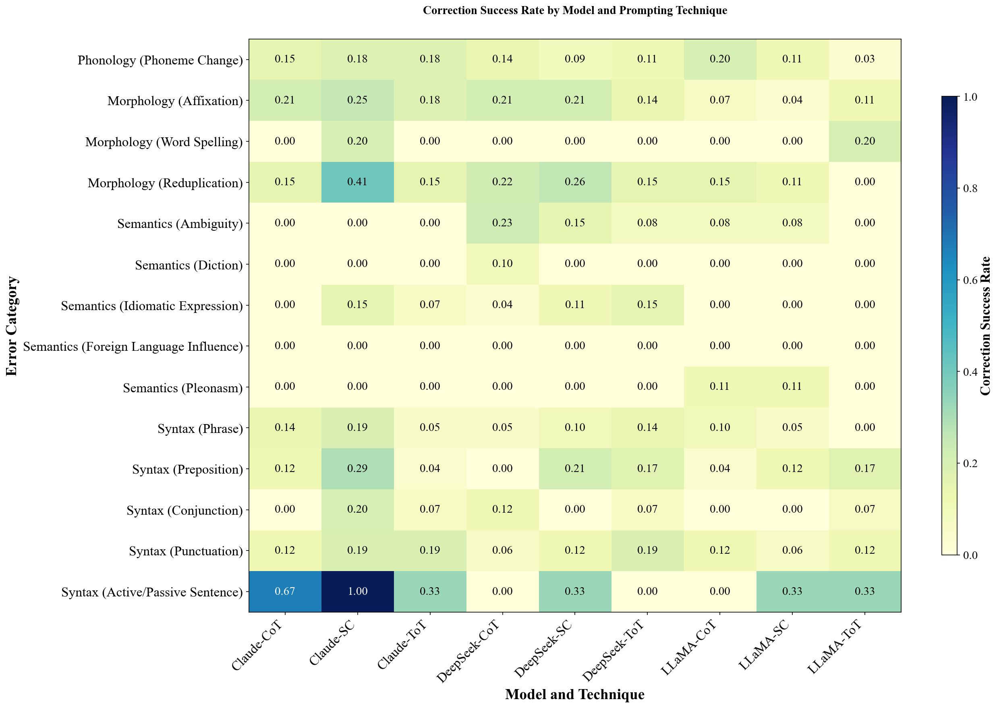

# indonesian-gec-gee
## Overview
This repository contains the Indonesian GEC-GEE Dataset - the first comprehensive corpus for Grammar Error Correction and Grammar Error Explanation in Indonesian language. The dataset was developed to address the critical research gap for low-resource languages in grammatical error correction and explanation tasks.

  
   
  <em>Experimental framework for Indonesian GEC-GEE.</em>

  
   
  <em>Performance metrics across model-technique combinations.</em>

  
   
  <em>Human evaluation results across four dimensions: semantic preservation, academic acceptability, explanation clarity, and educational value.</em>

  
   
  <em>Correction success rates across 14 grammatical error categories for each model and prompting technique.</em>

## Key Features
1,920 annotated sentence pairs from academic publications (2020-2024)
14 grammatical error categories covering syntax, semantics, morphology, and phonology
Expert validation by Indonesian linguistics specialists
CSV format for easy integration and analysis
Comprehensive evaluation of state-of-the-art LLMs with advanced reasoning techniques

## Dataset Structure
File Format: indonesian_gec_gee_dataset.csv
The dataset is provided as a CSV file with the following columns:
| Column | Description | Example |
|--------|-------------|---------|
| src | Source sentence containing grammatical error | "Saya akan pergi ke rumah sakit untuk memeriksa kesehatan" |
| trg | Target corrected sentence | "Saya akan pergi ke rumah sakit untuk memeriksakan kesehatan" |
| label | Error category/type | "morfologi_afiksasi" |
| explanation | Detailed explanation of the error in Indonesian | "Kata 'memeriksa' seharusnya 'memeriksakan' karena..." |

## Download Dataset
Direct Download Links

Full Dataset: https://drive.google.com/file/d/1iZ5Y83TPHZwdeya2OkMAF-L5YPH1Vuzd/view?usp=sharing

